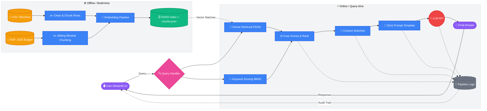

# Name: Kofi Assan | Index: 10022300129 | IT3241-Introduction to Artificial Intelligence

# Part F — Architecture & System Design

## 1. High-level Architecture Diagram

## 2. Components Interaction and Data Flow

The RAG application is split into two distinct phases: **Offline Build-time** and **Online Query-time**.

### Data Flow (Offline Build-time)
1. **Data Ingestion & Cleaning:** The Ghana Elections CSV and 2025 Budget PDF are loaded. Null values and whitespace are cleaned.
2. **Chunking Strategy:** 
   - The CSV is processed row-by-row. Each row is converted into a self-contained string chunk ensuring column semantics (like "Candidate Name" and "Votes") are preserved together.
   - The PDF uses a sliding window chunking technique (900 characters with a 120-character overlap) to maintain the context of long, spanning policy sentences.
3. **Embedding & Storage:** Both CSV and PDF chunks are embedded into dense vectors using `sentence-transformers`. The vectors and their metadata are stored in a local FAISS index (`index.faiss`) for fast retrieval.

### Data Flow (Online Query-time)
1. **User Query:** The user inputs a question via the Streamlit UI.
2. **Hybrid Retrieval:** The system performs two parallel searches:
   - **Dense Retrieval (FAISS):** Finds chunks with high semantic similarity to the query.
   - **Keyword Scoring (BM25):** Finds chunks with exact token matches (vital for specific numbers, names, or years).
3. **Score Fusion:** The semantic and keyword scores are normalized and combined. The chunks are re-ranked based on this fused score.
4. **Context Selection:** The system selects the highest-ranking chunks up to a strict character limit to ensure it fits within the LLM's context window.
5. **Prompt Construction:** The selected context is injected into a strict prompt template that forces the LLM to only answer based on the provided text, mitigating hallucination.
6. **LLM Generation:** The LLM receives the prompt and generates the final response, which is surfaced back to the user alongside the retrieved documents and similarity scores.

## 3. Justification: Why this design is suitable for the domain

This architecture was specifically tailored for querying election data and budget policies:

- **Handling Structured vs Unstructured Data:** The domain contains highly structured tabular data (elections) and unstructured long-form text (budget). The custom dual-chunking strategy (row-level for CSV, sliding windows for PDF) ensures that quantitative election margins aren't split mid-sentence, while dense budget paragraphs remain cohesive.
- **Why Hybrid Retrieval is Critical:** Election questions often rely on exact names (e.g., "John Mahama") or precise constituency figures. Pure dense vector retrieval often struggles with exact keyword matching and might retrieve a semantically similar but incorrect constituency. By fusing FAISS with BM25, the system excels at both conceptual queries ("What is the economic policy?") and exact fact-finding ("How many votes did candidate X get?").
- **Cost and Efficiency:** Using a local FAISS index and local sentence-transformers means the vector retrieval is completely free and runs offline, reducing API costs and latency.
- **Traceability:** In sensitive domains like government budgets and elections, hallucination is dangerous. Passing similarity scores, the selected chunks, and the exact prompt to the UI allows users to audit the LLM's answer and trust the output.
